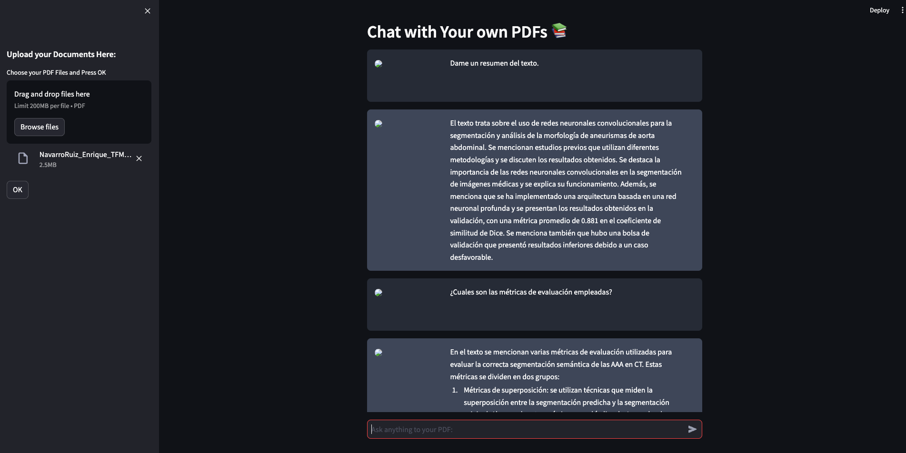

# langchain-chat-with-pdfs



This is a Python application that allows you to load a PDF and ask questions about it using natural language. The application uses a LLM to generate a response about your PDF. The LLM will not answer questions unrelated to the document.

## How it works

If you want to work with only one pdf, please place it in the `one-pdf` directory. This also works for books (with only one pdf). On the other hand, if you have two or more pdfs, your directory will be `multiples-pdfs`.(also accepts a single pdf) Both work in the same way. 

The applications reads the PDF (or PDFs) and splits the text into smaller chunks that can be then fed into a LLM. It uses OpenAI embeddings to create vector representations of the chunks. The application then finds the chunks that are semantically similar to the question that the user asked and feeds those chunks to the LLM to generate a response.

The applications uses Streamlit to create the GUI and Langchain to deal with the LLM.


## Installation

To install the repository, please clone this repository and install the requirements:

```
pip install -r requirements.txt
```

You will also need to add your OpenAI API key to the `.env` file.

## Usage

To use the application, run the `app.py` file with the streamlit CLI (after having installed streamlit): 

```
streamlit run app.py
```

## Use with HuggingFace
```
HUGGINGFACEHUB_API_TOKEN="<your key">

# For Huggingface Embeddings
embeddings = HuggingFaceInstructEmbeddings(model_name = "hkunlp/instructor-xl")

# For Huggingface LLM
llm = HuggingFaceHub(repo_id="google/flan-t5-xxl", model_kwargs={"temperature":0.5, "max_length":512})

```


## Contributing

This repository is for educational purposes only and is not intended to receive further contributions. 
